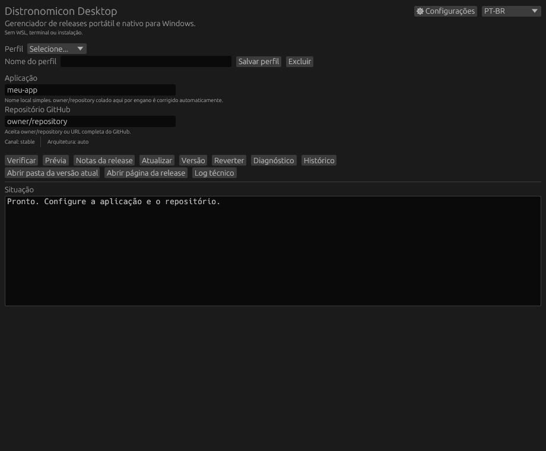

# Distronomicon Desktop

Gerenciador gráfico **nativo e portátil para Windows** que acompanha GitHub Releases, verifica atualizações, valida SHA-256, instala versões com rollback, mantém histórico, oferece automação pelo Windows Task Scheduler e não exige terminal, WSL, Cargo, Python ou Node para uso normal.

[](https://github.com/lowdrus/distronomicondesktop/actions/workflows/build-windows.yml)
[](https://github.com/lowdrus/distronomicondesktop/releases/latest)

## Downloads

- **[DistronomiconDesktop-Latest](https://github.com/lowdrus/distronomicondesktop/releases/latest)**
- **[Todas as versões](https://github.com/lowdrus/distronomicondesktop/releases)**
- **[Builds de CI](https://github.com/lowdrus/distronomicondesktop/actions/workflows/build-windows.yml)**

As releases usam o título curto `DISTROD-vX.Y.Z` e publicam:

- `DistronomiconDesktop.exe`
- `DistronomiconDesktop-Windows-Portable.zip`
- `SHA256SUMS.txt`

## Versão

Esta documentação acompanha **DISTROD v1.4.0**.

A v1.3 introduziu perfis, automação, Dry Run, health check/rollback, pinning, histórico, seleção inteligente, self-update, downloads retomáveis e persistência reforçada. A v1.4 adiciona a nova camada de segurança, recuperação, canais, arquitetura e UX descrita abaixo.

## Interface



A imagem acima é uma **captura real da interface v1.4**, renderizada automaticamente a partir do próprio código da aplicação no Windows CI. Ela substitui a prévia antiga quebrada/pixelada e é atualizada junto com a interface.

A interface é PT-BR/EN, possui tema Dark/Light e um botão **⚙ Configurações**. Automação do Windows, tema, canal, arquitetura, self-update, backup, retenção e opções avançadas ficam concentrados nesse painel.

## Correção do erro de “Aplicação inválida”

O campo **Aplicação** é um nome local simples, por exemplo `distronomicondesktop`. O campo **Repositório GitHub** aceita `owner/repository` ou a URL completa.

Na v1.4, se `owner/repository` for colado por engano no campo **Aplicação**, o Desktop detecta a entrada e converte automaticamente para o nome final do repositório. Exemplo:

```text
lowdrus/distronomicondesktop
```

vira:

```text
distronomicondesktop
```

Isso elimina o erro mostrado no teste sem enfraquecer as regras de nomes válidos do Windows.

## Recursos principais

### Verificar

Consulta a release alvo, registra o resultado no log técnico e, quando houver uma nova versão, pode emitir notificação nativa do Windows.

### Prévia / Dry Run

Não altera a instalação. Exibe versão atual, versão alvo, canal, arquitetura, pinning, asset selecionado, checksum, estimativa de espaço, possibilidade de downgrade e retenção prevista por quantidade.

### Notas da release

Mostra dentro da GUI o texto publicado pelo fornecedor na GitHub Release, junto com a tag e a página da release.

### Atualizar

Fluxo da v1.4:

1. valida configuração e nome local;
2. testa conectividade com o GitHub antes da operação longa;
3. seleciona Stable/Beta/Nightly ou a versão fixada;
4. escolhe asset compatível com x64/ARM64/x86;
5. bloqueia downgrade acidental, salvo autorização explícita;
6. estima espaço e valida espaço livre;
7. cria backup dos arquivos configuráveis definidos no perfil;
8. baixa de forma retomável e cancelável;
9. verifica SHA-256;
10. extrai em staging e ativa a release versionada;
11. valida Authenticode quando encontrar binários assinados;
12. executa restart opcional;
13. executa health check opcional e faz rollback automático em falha;
14. persiste `state.json` e `current.txt` com backup;
15. aplica retenção por quantidade, idade e espaço;
16. grava histórico, log técnico e notificação de conclusão.

### Cancelar download

Durante uma operação em andamento aparece **Cancelar download**. O cancelamento interrompe a transferência em blocos, preserva o arquivo parcial para retomada futura e **não altera a instalação atualmente ativa**.

### Abrir pasta / Abrir página

- **Abrir pasta da versão atual** abre a pasta da release ativa no Explorer.
- **Abrir página da release** abre a página de releases do repositório no navegador padrão.

### Diagnóstico e Recovery

O Doctor continua verificando estado, `current.txt`, release ativa e `bin`. O novo **Modo de recuperação** tenta reconstruir `state.json` a partir de `current.txt` e das releases existentes quando o estado principal e o backup não podem ser lidos.

### Log técnico

O Status continua voltado para mensagens operacionais ao usuário. O botão **Log técnico** abre um painel separado com registros persistentes e níveis `INFO`, `WARNING` e `ERROR` em:

```text
.distronomicon/<app>/technical.log
```

## Configurações da v1.4

### Stable / Beta / Nightly por perfil

- **Stable**: release estável mais recente.
- **Beta**: release marcada como prerelease mais recente.
- **Nightly**: release não-draft mais recente, incluindo prereleases.
- **Pinning** continua tendo prioridade quando uma tag específica é informada.

### Arquitetura

O modo `Auto` detecta a arquitetura do executável/sistema em uso e aplica pontuação ao asset. Também é possível forçar:

- x64
- ARM64
- x86

Assets Linux/macOS e arquiteturas incompatíveis recebem penalidade na seleção.

### Backup automático antes do update

No perfil, informe arquivos ou pastas separados por `;` ou nova linha. Caminhos relativos são resolvidos a partir da pasta `bin` da aplicação; caminhos absolutos também são aceitos.

Os backups ficam em:

```text
.distronomicon/<app>/backups/<timestamp>/
```

Arquivos inexistentes geram Warning e não impedem a atualização dos demais itens.

### Authenticode

Com **Validar Authenticode quando houver assinatura** ativado, executáveis `.exe` instalados são consultados pelo mecanismo do Windows. Binários sem assinatura não são rejeitados; binários que possuem assinatura mas retornam status inválido interrompem a promoção e acionam rollback para a versão anterior quando possível.

### Retenção

A v1.4 combina três políticas:

- quantidade máxima de releases;
- idade máxima em dias (`0` desativa);
- limite de espaço ocupado pelas releases em MB (`0` desativa).

A versão ativa nunca é removida pela retenção.

### Proteção contra downgrade

Por padrão, se a versão alvo for numericamente menor que a versão atual, o update é bloqueado. O usuário precisa habilitar **Permitir downgrade explicitamente** no perfil para autorizar essa operação.

### Notificações nativas do Windows

Quando habilitadas, avisam sobre atualização encontrada e atualização concluída. O envio ocorre sem abrir janela de terminal visível.

### Exportar / Importar perfis

**Exportar perfis** gera:

```text
DistronomiconProfiles.json
```

ao lado do executável. O arquivo pode ser copiado para outro PC. **Importar perfis** lê esse mesmo arquivo, mescla os perfis por nome e salva o resultado com a persistência segura já usada pelo aplicativo.

Tokens GitHub continuam fora dos perfis exportados.

### Automação do Windows

No menu Configurações:

- Somente verificar;
- Verificar e atualizar;
- intervalo de 1 a 1440 minutos;
- Ativar automação;
- Remover automação.

A tarefa usa o mesmo `.exe` em modo silencioso e grava o resultado agendado em `.distronomicon/scheduled/`.

### Self-update

O botão **Atualizar o Distronomicon Desktop** permanece no menu Configurações. O self-updater consulta a release do próprio projeto, baixa o novo `.exe`, valida `SHA256SUMS.txt`, impede downgrade automático e prepara a substituição sem exigir terminal do usuário.

## Repositório GitHub aceito

O campo de repositório aceita:

```text
owner/repository
https://github.com/owner/repository
http://github.com/owner/repository
github.com/owner/repository
https://github.com/owner/repository.git/
```

A entrada é normalizada internamente para `owner/repository`.

## Arquivos compactados suportados

- `.zip`
- `.tar.gz` / `.tgz`
- `.tar.bz2` / `.tbz2`
- `.tar.xz` / `.txz`
- `.tar.zst`
- assets não compactados como `.exe`

A extração protege contra path traversal, links indevidos, excesso de arquivos, expansão abusiva e entradas perigosas.

## Estrutura portátil

```text
DistronomiconDesktop.exe
DistronomiconProfiles.json        # somente quando exportado
managed/
  <app>/
    bin/
    releases/
      <tag>/
    staging/
    current.txt
    current.txt.bak
.distronomicon/
  profiles.json
  profiles.json.bak
  <app>/
    state.json
    state.json.bak
    history.json
    history.json.bak
    technical.log
    backups/
    downloads/
    lock
  scheduled/
  self-update/
```

## Segurança e recuperação

O update usa lock por aplicação, staging, SHA-256, espelhamento seguro para `bin`, rollback de filesystem, health check opcional, Authenticode quando aplicável e persistência atômica com arquivos `.bak`.

Se `state.json` estiver ausente/corrompido, a leitura tenta `state.json.bak`. Se ambos falharem, o Modo de recuperação pode reconstruir a tag ativa usando `current.txt` validado ou a release instalada mais recente.

## Paridade com o Distronomicon Linux

| Recurso | Linux | Desktop Windows |
|---|---:|---:|
| GitHub Releases | ✅ | ✅ |
| Check / Update / Version / Unlock | ✅ | ✅ |
| SHA-256 | ✅ | ✅ |
| Regex de asset | ✅ | ✅ |
| Token / GitHub Enterprise | ✅ | ✅ |
| ETag / Last-Modified | ✅ | ✅ |
| Lock / staging / retenção | ✅ | ✅ |
| Restart | ✅ | ✅ |
| ZIP/TAR comprimidos | ✅ | ✅ |
| GUI nativa | ❌ | ✅ |
| PT-BR / EN | ❌ | ✅ |
| EXE portátil | ❌ | ✅ |
| Perfis | — | ✅ |
| Task Scheduler | systemd | ✅ |
| Dry Run | — | ✅ |
| Health check + rollback | — | ✅ |
| Histórico | — | ✅ |
| Resume | — | ✅ |
| Self-update | — | ✅ |
| Stable/Beta/Nightly | — | ✅ |
| Backup configurável | — | ✅ |
| Authenticode | — | ✅ |
| Retenção por dias/espaço | — | ✅ |
| Recovery de state | — | ✅ |
| Importar/exportar perfis | — | ✅ |
| Log técnico separado | — | ✅ |
| Notificações Windows | — | ✅ |
| x64 / ARM64 / x86 | — | ✅ |
| Anti-downgrade | — | ✅ |
| Release notes na GUI | — | ✅ |
| Cancelamento seguro | — | ✅ |

## CI/CD

Cada PR é validado em Windows com:

1. geração/validação do `Cargo.lock`;
2. `rustfmt`;
3. Clippy com warnings tratados como erro;
4. testes;
5. build MSVC release com CRT estático;
6. geração do pacote portátil;
7. verificação da assinatura `MZ` do executável;
8. validação de ícone embutido;
9. artifact de CI.

No `main`, o workflow também publica/atualiza a GitHub Release com título `DISTROD-vX.Y.Z`, EXE, ZIP e SHA256SUMS.

## Uso rápido

1. Baixe a última release.
2. Extraia o ZIP em uma pasta gravável.
3. Execute `DistronomiconDesktop.exe`.
4. Informe o nome da Aplicação e o Repositório GitHub.
5. Abra ⚙ Configurações para canal, arquitetura, backup, retenção e automação.
6. Clique **Verificar**.
7. Leia **Notas da release** e use **Prévia**.
8. Clique **Atualizar**.
9. Use **Diagnóstico**, **Histórico** e **Log técnico** quando necessário.

Nenhum passo de uso normal exige CMD, PowerShell visível, WSL ou Cargo.

## Ideias para próximas versões

- assinatura do próprio DISTROD com certificado de código e publicação da cadeia de confiança;
- atualização delta/binária para reduzir downloads grandes;
- múltiplos mirrors/fallbacks além do GitHub;
- política de janela de manutenção e horários permitidos por perfil;
- rollback automático também por crash/timeout observado após o primeiro launch;
- comparação visual de release notes entre versão atual e alvo;
- painel de saúde dos perfis mostrando último check, última atualização e próxima execução;
- regras por asset além de Regex, como fabricante, extensão, arquitetura e tamanho mínimo/máximo;
- exclusões de backup com glob (`*.log`, caches, temporários);
- rotação/compactação do log técnico;
- exportação de diagnóstico em ZIP para suporte;
- modo “somente baixar” sem instalar;
- fila de atualização de vários perfis;
- política “update canary”: atualizar um perfil, validar, depois continuar os demais;
- verificação opcional de assinatura Sigstore/cosign além de Authenticode;
- histórico com diff dos arquivos alterados entre releases;
- restauração guiada de um backup configurável criado antes do update;
- indicador de progresso/velocidade/ETA do download;
- suporte a proxy corporativo configurável por perfil;
- política de limite mensal de banda para automações.

## Projeto de Linux para Nativo

**by: lowdrus, canadian192, lincolhalles.**

O Distronomicon Desktop preserva os conceitos centrais do projeto Linux e substitui integrações POSIX por equivalentes apropriados para Windows.

O projeto original é MIT. A atribuição e o texto jurídico permanecem em [`THIRD_PARTY_NOTICES.md`](THIRD_PARTY_NOTICES.md).

