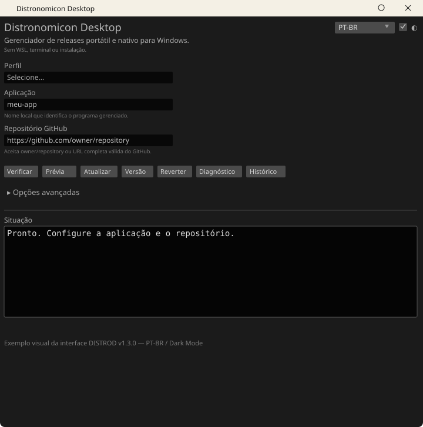

# Distronomicon Desktop

Aplicativo gráfico nativo e portátil para Windows que gerencia GitHub Releases com verificação SHA-256, instalação versionada, rollback, diagnóstico, retenção, prereleases, GitHub Enterprise, perfis, automação e atualização sem terminal ou WSL.

[](https://github.com/lowdrus/distronomicondesktop/actions/workflows/build-windows.yml)
[](https://github.com/lowdrus/distronomicondesktop/releases/latest)

### Downloads rápidos

- **[DistronomiconDesktop-Latest](https://github.com/lowdrus/distronomicondesktop/releases/latest)**
- **[Todas Versões - Releases](https://github.com/lowdrus/distronomicondesktop/releases)**
- **[DistronomiconDesktop BUILDS DE CI](https://github.com/lowdrus/distronomicondesktop/actions/workflows/build-windows.yml)**

As novas releases usam título curto no GitHub: `DISTROD-vX.Y.Z`.

Arquivos publicados:

- `DistronomiconDesktop-Windows-Portable.zip`
- `DistronomiconDesktop.exe`
- `SHA256SUMS.txt`

## Status

Versão em desenvolvimento nesta branch: **v1.3.0**.

O executável final é Windows x86-64 com CRT estático. O usuário não precisa instalar Rust, Cargo, Python, Node, WSL, Ubuntu ou Visual C++ Redistributable adicional.

A interface possui **PT-BR / EN**, tema **Dark / Light** com acento dourado inspirado no macOS Golden Gate e ícone próprio no `.exe`.

## Exemplo visual



O SVG acima reproduz o fluxo da interface e é versionado junto da documentação para não depender de imagem externa.

## O que o Distronomicon Desktop faz

O Distronomicon Desktop consulta releases de qualquer repositório GitHub válido, escolhe o asset adequado, baixa com retry e retomada, verifica SHA-256, extrai com proteções de segurança, instala em diretórios versionados, ativa a nova versão, mantém versões anteriores conforme retenção, permite rollback e registra estado/histórico.

O campo **Repositório GitHub** aceita tanto:

```text
owner/repository
```

quanto:

```text
https://github.com/owner/repository
```

Também aceita `github.com/owner/repository`, barra final e sufixo `.git`. A entrada é normalizada internamente para `owner/repository` antes da chamada à API. Não há vínculo com `lowdrus`; qualquer repositório GitHub válido pode ser usado.

## Função por função

### Aplicação

É um nome local escolhido pelo usuário para identificar o programa gerenciado. Exemplos:

```text
distronomicondesktop
cinetwitch
maginarium
meu-servidor
```

Esse nome cria uma área separada em `managed/<aplicacao>/` e `.distronomicon/<aplicacao>/`. Nomes inválidos para Windows, nomes reservados como `CON`, `AUX`, `NUL`, `COM1` e caracteres proibidos são rejeitados antes da instalação.

### Perfil

Salva persistentemente as configurações de uma aplicação. Você pode cadastrar vários programas e alternar entre eles pelo ComboBox sem redigitar repositório, Regex, pastas, retenção, pinning, health check ou automação. Tokens GitHub não são gravados no perfil.

### Verificar / Check

Consulta a release alvo e informa se existe atualização. Não instala nada.

### Prévia / Dry Run

Mostra sem alterar o disco:

- versão atual;
- versão alvo;
- versão fixada, se houver;
- asset selecionado;
- arquivo de checksum;
- destino da instalação.

### Atualizar / Update

Executa o fluxo completo:

1. obtém a release;
2. respeita prerelease/version pinning;
3. escolhe o asset Windows adequado;
4. baixa com retry e retomada HTTP Range;
5. verifica SHA-256;
6. extrai para staging;
7. promove a release para `releases/<tag>`;
8. troca `bin` com rollback de filesystem em caso de falha;
9. atualiza `current.txt` e `state.json` de forma reforçada;
10. executa restart opcional;
11. executa health check opcional;
12. volta automaticamente à versão anterior se o health check falhar;
13. aplica retenção;
14. grava histórico.

### Versão / Version

Mostra a release atualmente ativa.

### Reverter / Rollback

Volta para a release instalada anterior sem novo download e registra a operação no histórico.

### Diagnóstico / Doctor

Verifica coerência entre `current.txt`, `state.json`, release ativa, diretório `bin` e releases armazenadas.

### Histórico / History

Exibe as operações recentes, incluindo update/rollback, versão anterior/nova, asset, SHA-256 e resultado.

### Forçar desbloqueio / Force unlock

O lock impede duas atualizações simultâneas na mesma aplicação. Use **Forçar desbloqueio** somente se uma atualização anterior foi interrompida e deixou o lock preso. No uso normal não é necessário.

### PT-BR / EN

O seletor troca a interface entre Português do Brasil e Inglês. Mensagens operacionais novas da v1.3 também usam o mesmo sistema de tradução.

### Dark / Light

O controle `◐` alterna os temas mantendo a identidade visual dourada.

## As 10 melhorias da v1.3

### 1. Perfis persistentes

Cada perfil armazena aplicação, repositório, Regex, diretórios, prerelease, retenção, restart, health check, pin de versão e automação. Os perfis ficam próximos ao executável em `.distronomicon/profiles.json`, com escrita protegida por temporário/backup.

### 2. Auto Check / Auto Update Windows

A GUI pode registrar uma tarefa no **Windows Task Scheduler** sem abrir terminal visível. O perfil define:

- `check`: apenas verifica;
- `update`: verifica e atualiza;
- intervalo em minutos.

A execução agendada reutiliza o mesmo `.exe` em modo silencioso e grava log em `.distronomicon/scheduled/`.

### 3. Dry Run

O botão **Prévia** permite revisar exatamente o que será usado antes da atualização.

### 4. Health Check + rollback automático

Depois da atualização, um comando opcional de verificação pode validar o aplicativo. Se falhar, o Desktop reativa a versão anterior, restaura o estado e executa novamente o comando de restart quando configurado.

### 5. Version Pinning

O perfil pode permanecer em `latest` ou apontar para uma tag específica, por exemplo:

```text
v2.4.1
```

Nesse modo a release é consultada diretamente por tag.

### 6. Histórico de updates/rollbacks

Cada aplicação mantém `history.json`, limitado às entradas mais recentes, com versão anterior/nova, asset, SHA-256, resultado e timestamp.

### 7. Seleção inteligente de asset

Depois de aplicar a Regex configurada, os candidatos recebem prioridade para nomes que indiquem:

- `windows`, `win64` ou `win-`;
- `x86_64`, `x64` ou `amd64`;
- `.zip` / `.exe`;
- `portable`.

Assets Linux/macOS e arquiteturas incompatíveis recebem penalidade. Uma Regex explícita do usuário continua tendo prioridade como filtro.

### 8. Auto-update do Distronomicon Desktop

O aplicativo consulta a própria release, baixa `DistronomiconDesktop.exe`, valida `SHA256SUMS.txt`, prepara a troca e reinicia sem janela de terminal visível. O mecanismo também impede downgrade automático para uma versão mais antiga.

### 9. Downloads retomáveis

Arquivos parciais são retomados com HTTP `Range` quando o servidor devolve `206 Partial Content`; se o servidor não aceitar retomada, o download recomeça do zero com segurança.

### 10. Persistência reforçada

`state.json` e `current.txt` usam escrita temporária + `sync_all` + backup + rename, com restauração do backup se a substituição falhar. `state.json` também pode recuperar o backup caso o arquivo principal esteja ausente ou corrompido.

## Paridade com o Distronomicon Linux

O projeto linux DISTRONOMICON é uma ferramenta Linux que consulta GitHub Releases e executa atualizações atômicas. O Distronomicon Desktop preserva esse núcleo e substitui integrações exclusivas de Linux por equivalentes apropriados para Windows.

| Recurso | Distronomicon Linux | Desktop Windows |
|---|---:|---:|
| Consultar GitHub Releases | ✅ | ✅ |
| Check / Update / Version / Unlock | ✅ | ✅ |
| Regex de asset | ✅ | ✅ |
| SHA-256 | ✅ | ✅ |
| GitHub token | ✅ | ✅ |
| GitHub Enterprise/API host | ✅ | ✅ |
| Prereleases e drafts | ✅ | ✅ |
| ETag / Last-Modified | ✅ | ✅ |
| Retry/backoff | ✅ | ✅ |
| Timeout HTTP | ✅ | ✅ |
| Lock + timeout | ✅ | ✅ |
| Staging | ✅ | ✅ |
| Retenção | ✅ | ✅ |
| Restart | ✅ | ✅ |
| ZIP/TAR comprimidos | ✅ | ✅ |
| Proteções de extração | ✅ | ✅ |
| Version pinning | — | ✅ |
| Download retomável | — | ✅ |
| Perfis | — | ✅ |
| Histórico | — | ✅ |
| Health check + auto rollback | — | ✅ |
| Auto-update do próprio app | — | ✅ |
| GUI PT-BR / EN | ❌ | ✅ |
| Dark / Light | ❌ | ✅ |
| EXE portátil | ❌ | ✅ |
| systemd timer | ✅ | Task Scheduler |
| CLI Linux | ✅ | GUI + modo agendado interno |

### O que não tem pariedade literalmente

- `systemd/`: no Windows é substituído pelo Task Scheduler opcional;
- symlinks/permissões POSIX: o Desktop usa releases versionadas, `current.txt` e espelhamento de `bin` por hard links/cópia;
- CLI Linux: o uso normal é totalmente gráfico; argumentos internos existem apenas para automação agendada.

## Segurança da instalação

A extração suporta:

- `.zip`
- `.tar.gz` / `.tgz`
- `.tar.bz2` / `.tbz2`
- `.tar.xz` / `.txz`
- `.tar.zst`
- assets não compactados, como `.exe`

Há proteção contra path traversal, symlinks indevidos, excesso de arquivos, tamanho excessivo e razão de descompressão abusiva. Archives com uma única pasta raiz são normalizados.

## Estrutura portátil

```text
DistronomiconDesktop.exe
managed/
  <app>/
    bin/
    releases/
      <tag>/
    staging/
    current.txt
    current.txt.bak
.distronomicon/
  profiles.json
  <app>/
    state.json
    state.json.bak
    history.json
    lock
    downloads/
  scheduled/
  self-update/
```

## Uso passo a passo

1. Baixe **DistronomiconDesktop-Windows-Portable.zip** na última release.
2. Extraia para uma pasta com permissão de escrita.
3. Execute `DistronomiconDesktop.exe`.
4. Escolha ou crie um **Perfil**.
5. Informe **Aplicação**.
6. Cole `owner/repository` ou a URL completa do GitHub.
7. Clique **Verificar**.
8. Use **Prévia** para revisar a atualização.
9. Clique **Atualizar**.
10. Confirme em **Versão** e **Diagnóstico**.
11. Se necessário, use **Reverter**.

Nenhum desses passos exige CMD, PowerShell, WSL ou Cargo.

## CI/CD e Releases

O workflow Windows valida:

1. `Cargo.lock`;
2. `rustfmt`;
3. Clippy com `-D warnings`;
4. testes;
5. build MSVC release com CRT estático;
6. pacote ZIP;
7. assinatura `MZ` do executável;
8. ícone embutido;
9. artifact do CI;
10. `SHA256SUMS.txt`;
11. GitHub Release.

A release publicada recebe título curto `DISTROD-vX.Y.Z`.

## Sobre commits antigos com erro

Commits históricos com check vermelho representam estados antigos e não quebram a release atual. O critério de distribuição é: head atual verde, testes/build verdes e release produzida desse estado. Reescrever todo o histórico apenas para esconder falhas antigas não é recomendado.

## Roadmap além da v1.3

Ideias coerentes para próximas versões:

- notificações nativas do Windows;
- assinatura Authenticode/Sigstore quando aplicável;
- retenção também por espaço em disco ou dias;
- canais Stable/Beta/Nightly por perfil;
- exportar/importar perfis;
- botão para abrir pasta atual e página da release;
- botão cancelar download;
- estimativa de espaço necessário;
- proteção contra downgrade manual acidental;
- release notes dentro da GUI;
- mirrors/fontes adicionais além do GitHub;
- ARM64 quando houver demanda.

## Projeto de Linux Para Nativo

**by: lowdrus, canadian192, lincolhalles.**

O Distronomicon Desktop é uma adaptação Windows nativa e portátil construída para preservar os conceitos centrais do projeto Linux e oferecer uma experiência gráfica sem terminal ou WSL.

O projeto original é licenciado sob MIT. A atribuição jurídica e o texto da licença permanecem em [`THIRD_PARTY_NOTICES.md`](THIRD_PARTY_NOTICES.md).
